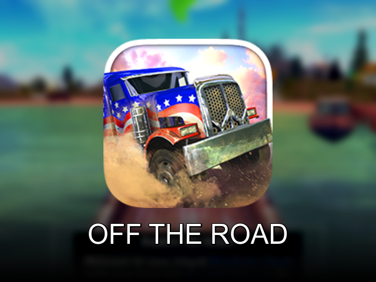
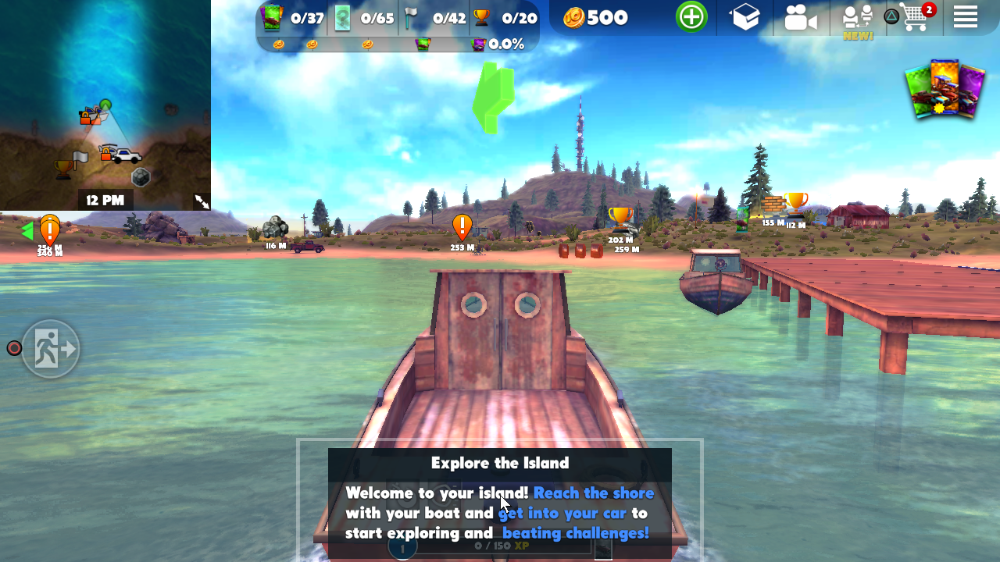
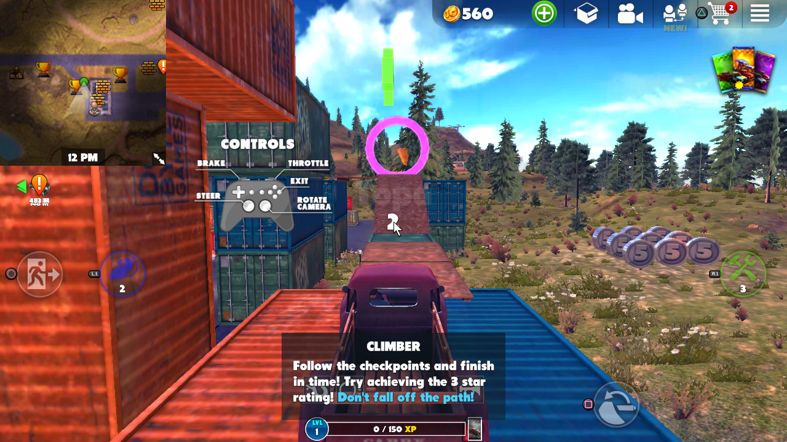
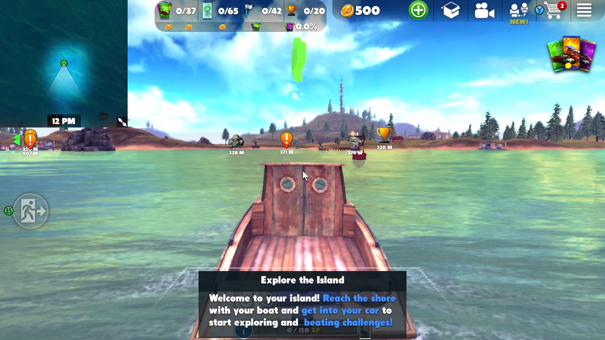

# Off The Road — NextOS port



**Off The Road — Open World Driving** (DogByte Games) running natively on Linux
handhelds. No Android runtime, no emulation, no streaming: the game's own ARM64
engine library is mapped by a native AArch64 so-loader that answers the Android
platform surface it expects, while the game renders through the handheld's real
EGL/OpenGL ES driver.

BYO-data package: **no game file is distributed here**. You bring your own
lawfully obtained Android copy.

---

## The game

An island, a beat-up truck and no roads worth the name. Off The Road is an
open-world off-road sandbox: climb hills that should not be climbable, ford
rivers, wreck fences, haul cargo, take a boat out to the next stretch of coast
and drag whatever you find back to the garage. Challenges and checkpoints are
scattered across the map, and everything you complete feeds the next vehicle in
the collection.

No lap counter, no five-minute race. You drive where you want, and the physics
decide whether that was a good idea.

| | |
|---|---|
|  |  |
| Open world at 1280x720 on the Mali-450 | A challenge, with the game's own gamepad prompts |



All three are direct captures from the released build on the device itself. No
mockups, no PC emulator.

## Community

Questions, bug reports, screenshots of it running on your handheld:

**https://discord.gg/DHfY62eDNN**

## Install

1. Install the release ZIP through PortMaster, or extract it at the ROM root so
   that `Off The Road.sh` lands in `ports/` and the payload in
   `ports/offtheroad/`.
2. Drop your legally obtained Android copy of the game (`.apk`, `.apkm`,
   `.apks` or `.xapk`) into `ports/offtheroad/gamedata/`. The filename does not
   matter.
3. Open **Off The Road** from the Ports list.

On the first launch NXExtract identifies the container by content, validates
the package id, the ABI and the structure of the engine payload, unpacks
`libgame.so`, `libc++_shared.so` and the roughly 522 MB of `assets/`, and
commits the installation transactionally, with resume and rollback. Every later
launch goes straight into the game.

The recipe is structural: it accepts any legitimate build of the 1.18.2 family.
A copy without the optional ads-config asset installs fine.

Full step-by-step, in English and Portuguese: [INSTALLATION.md](INSTALLATION.md).

## Controls

The loader feeds the engine's own gamepad API (`cocos2d::nativeGamepad*`) — real
controller events, never simulated touch. Steering, throttle, brake and camera
are the game's own bindings.

| Action | Button |
|---|---|
| Steer | left stick |
| Throttle / brake | as shown in-game |
| Camera | right stick |
| Pointer mode on/off | **L3** |
| Pointer click (in pointer mode) | **R3** |
| Save and quit | **SELECT + START** |

The right stick is camera only — no cursor rides on it. The menus and the shop
are touch screens, so **L3** switches the right stick to a pointer and **R3**
clicks; **L3** again gives the camera back.

`NEXTOSCONTROLLERS.gptk` in the port folder is yours to edit; updating the port
never overwrites it.

## Graphics profile (`OT_DETAIL`)

The game has four internal detail tiers (0–3), but its own auto-benchmark only
measures fill-rate and therefore pins the maximum tier on every handheld — which
is exactly where the frame rate dies. This port forces **low** by default. On an
RK3326 that is the difference between about 11 fps and about 79 fps.

| `OT_DETAIL` | effect |
|---|---|
| `low` *(default)* | tier 0 — maximum frame rate |
| `medium` / `high` / `ultra` | tiers 1 / 2 / 3 |
| `auto` | the game's original behaviour (its benchmark decides) |

## Devices

Proven physically **with this exact release ZIP**, from a clean install through
gameplay to a clean exit:

| Device class | Graphics | Result |
|---|---|---|
| Amlogic-old AArch64, NextOS (R36S-class) | Mali-450 (Utgard), OpenGL ES 2.0, 1280x720 | clean install (NXE0000), frame proof 100%, 30 fps, clean audio, exit 0 |

Measured earlier on the same universal build line: about 31 fps in the open
world and 60 fps in menus on the Mali-450 with roughly 167 MB resident, and
about 79 fps at 640x480 on an RK3326 / Mali-G31 handheld at the default detail
tier.

The loader ELF is `arm64` and links no higher than **GLIBC 2.27**, so this is a
universal AArch64 package rather than a firmware-specific build. Other AArch64
handhelds are very likely to work — if you run it elsewhere, tell us in the
Discord.

## How it works

- **Engine:** **xGen** (DogByte) with **Horde3D** and **bgfx**, on a Cocos2d-x
  shell. This is not Unity: there is no IL2CPP, no AssetBundle and no shader
  blob — the 294 GLSL shaders are compiled at runtime on the device.
- **Loader:** `offtheroad` maps `libc++_shared.so` and then `libgame.so`, runs
  the Cocos2d-x lifecycle in the native Android order and provides the JNI,
  asset, preferences and Bionic surfaces the engine calls.
- **Graphics:** the loader owns the GL context. The engine hands its
  `bgfx::PlatformData` the already-current EGL context, so bgfx imports it
  instead of creating its own surface, and picks its GLES backend by itself.
- **Audio:** OpenSL ES bridged to SDL2, with the embedded OpenAL configured
  through the bundled `alsoft.conf`.
- **Input:** the five exported `cocos2d::nativeGamepad*` entry points are called
  directly with real Android keycodes and axis values. The pad type announced to
  the game governs both the on-screen glyphs and the keycode mapping, so the port
  announces the generic type and translates 1:1.
- **Runtime:** the launcher runs the game in the foreground, holds a
  single-instance lock and keeps `HOME` inside the port directory, so saves live
  with the port. SELECT + START saves and exits immediately.

## Build

```sh
./build_universal.sh          # universal low-glibc AArch64 loader
./package/build-package.sh    # gate + bundle the release ZIP
```

The packaging script needs the pinned NextOS release tooling, named through
`NEXTOS_FRAMEWORK_ROOT`; without it, it stops with a clear message. Building the
loader itself only needs the toolchain and a sysroot with SDL2/EGL/GLES headers.

## Licensing and credits

- **Off The Road — Open World Driving** is © DogByte Games. This is an
  independent interoperability project, not affiliated with or endorsed by
  DogByte Games. The game, its data and its trademarks belong to their rights
  holders.
- The loader and the NextOS runtime components in this repository are licensed
  under the **GNU GPL v3.0** — see [LICENSE](LICENSE).
- NXExtract is MIT licensed — see [licenses/](licenses).
- Screenshots are used for identification and documentation only.

---

# Português

**Off The Road — Open World Driving** (DogByte Games) rodando nativamente em
portáteis Linux. Sem runtime Android, sem emulação e sem streaming: a biblioteca
ARM64 original da engine é mapeada por um so-loader AArch64 nativo, que responde
às interfaces de plataforma Android que ela espera, enquanto o jogo desenha no
EGL/OpenGL ES real do aparelho.

Pacote BYO-data: **nenhum arquivo do jogo é distribuído aqui**. Você usa a sua
cópia Android legalmente obtida.

## O jogo

Uma ilha, uma picape surrada e nenhuma estrada que preste. Off The Road é um
sandbox off-road de mundo aberto: suba morros que não deviam ser subidos,
atravesse rios, derrube cercas, leve carga, pegue um barco até o próximo trecho
de costa e arraste de volta pra garagem o que encontrar. Desafios e checkpoints
estão espalhados pelo mapa, e tudo que você completa alimenta o próximo veículo
da coleção.

Sem contador de voltas e sem corrida de cinco minutos. Você dirige para onde
quiser, e a física decide se foi boa ideia.

As três fotos acima são capturas diretas da build publicada, tiradas no próprio
aparelho — sem mockup e sem emulador de PC.

### Comunidade

Dúvidas, relatos de bug e fotos rodando no seu portátil:

**https://discord.gg/DHfY62eDNN**

### Instalação

1. Instale o ZIP pelo PortMaster, ou extraia na raiz de ROMs de modo que
   `Off The Road.sh` fique em `ports/` e o conteúdo em `ports/offtheroad/`.
2. Coloque a sua cópia Android legalmente obtida (`.apk`, `.apkm`, `.apks` ou
   `.xapk`) em `ports/offtheroad/gamedata/`. O nome do arquivo não importa.
3. Abra **Off The Road** na lista de Ports.

Na primeira abertura o NXExtract identifica o container pelo conteúdo, valida
package, ABI e a estrutura do payload da engine, extrai a `libgame.so`, a
`libc++_shared.so` e os cerca de 522 MB de `assets/`, e conclui a instalação de
forma transacional, com retomada e rollback. Nas próximas vezes o jogo abre
direto.

A receita é estrutural: aceita qualquer build legítima da família 1.18.2. Uma
cópia sem o asset opcional de configuração de anúncios instala normalmente.

Passo a passo completo em [INSTALLATION.md](INSTALLATION.md).

### Controles

O loader alimenta a própria API de gamepad da engine (`cocos2d::nativeGamepad*`)
— eventos de controle de verdade, nunca toque simulado. Direção, acelerador,
freio e câmera são os do próprio jogo.

| Ação | Botão |
|---|---|
| Dirigir | analógico esquerdo |
| Acelerar / frear | como o jogo mostra na tela |
| Câmera | analógico direito |
| Liga/desliga o modo ponteiro | **L3** |
| Clique do ponteiro (no modo ponteiro) | **R3** |
| Salvar e sair | **SELECT + START** |

O analógico direito é só câmera — nenhum cursor anda nele. Menu e loja são de
toque, então **L3** transforma o analógico direito em ponteiro e o **R3** clica;
**L3** de novo devolve a câmera.

O arquivo `NEXTOSCONTROLLERS.gptk` na pasta do port é seu para editar;
atualizar o port nunca sobrescreve a sua cópia.

### Perfil gráfico (`OT_DETAIL`)

O jogo tem quatro níveis internos de detalhe (0–3), mas o auto-benchmark dele
mede só *fill-rate* e por isso crava o nível máximo em qualquer portátil — que é
exatamente onde a taxa de quadros morre. Este port força **low** por padrão. Num
RK3326 isso é a diferença entre uns 11 fps e uns 79 fps.

| `OT_DETAIL` | efeito |
|---|---|
| `low` *(padrão)* | nível 0 — máximo de fps |
| `medium` / `high` / `ultra` | níveis 1 / 2 / 3 |
| `auto` | comportamento original do jogo (o benchmark decide) |

### Aparelhos

Provado fisicamente **com este mesmo ZIP**, da instalação limpa até jogar e sair
limpo:

| Classe de aparelho | Vídeo | Resultado |
|---|---|---|
| Amlogic-old AArch64, NextOS (linha R36S) | Mali-450 (Utgard), OpenGL ES 2.0, 1280x720 | instalação limpa (NXE0000), frame proof 100%, 30 fps, áudio limpo, saída 0 |

Medido antes na mesma linha de build universal: cerca de 31 fps no mundo aberto
e 60 fps em menu no Mali-450, com uns 167 MB residentes, e cerca de 79 fps a
640x480 num portátil RK3326 / Mali-G31 no nível de detalhe padrão.

O ELF do loader é `arm64` e não exige mais que **GLIBC 2.27**, então o pacote é
universal e não uma build presa a um firmware. Outros portáteis AArch64 têm tudo
para funcionar — rodou no seu, conta lá no Discord.

### Como funciona

- **Engine:** **xGen** (DogByte) com **Horde3D** e **bgfx**, sobre uma casca
  Cocos2d-x. Não é Unity: não há IL2CPP, nem AssetBundle, nem blob de shader — os
  294 shaders GLSL são compilados em runtime, no aparelho.
- **Loader:** o `offtheroad` mapeia a `libc++_shared.so` e depois a
  `libgame.so`, roda o lifecycle do Cocos2d-x na ordem nativa do Android e
  fornece as interfaces de JNI, asset, preferências e Bionic que a engine chama.
- **Vídeo:** o dono do contexto GL é o loader. A engine entrega ao
  `bgfx::PlatformData` o contexto EGL já corrente, então o bgfx importa esse
  contexto em vez de criar a própria surface, e escolhe sozinho o backend GLES.
- **Áudio:** OpenSL ES em ponte para o SDL2, com o OpenAL embutido configurado
  pelo `alsoft.conf` que acompanha o pacote.
- **Controle:** os cinco pontos de entrada `cocos2d::nativeGamepad*` exportados
  são chamados direto, com keycodes e eixos reais do Android. O tipo de pad
  anunciado ao jogo governa tanto os glifos na tela quanto o remape de keycode,
  então o port anuncia o tipo genérico e traduz 1:1.
- **Runtime:** o launcher roda o jogo em primeiro plano, segura uma trava de
  instância única e mantém o `HOME` dentro da pasta do port, então os saves moram
  junto com ele. SELECT + START salva e encerra na hora.

### Licenças e créditos

- **Off The Road — Open World Driving** é © DogByte Games. Este é um projeto
  independente de interoperabilidade, sem afiliação nem endosso da DogByte
  Games. O jogo, seus dados e suas marcas pertencem aos respectivos detentores.
- O loader e os componentes de runtime do NextOS deste repositório estão sob a
  **GNU GPL v3.0** — veja [LICENSE](LICENSE).
- O NXExtract é MIT — veja [licenses/](licenses).
- As capturas de tela servem apenas para identificação e documentação.
